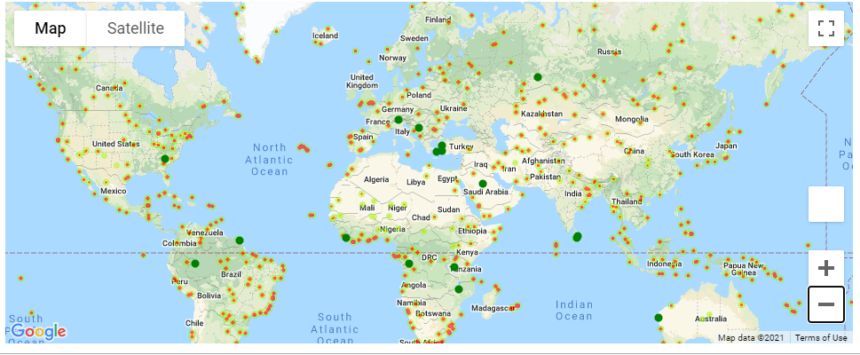
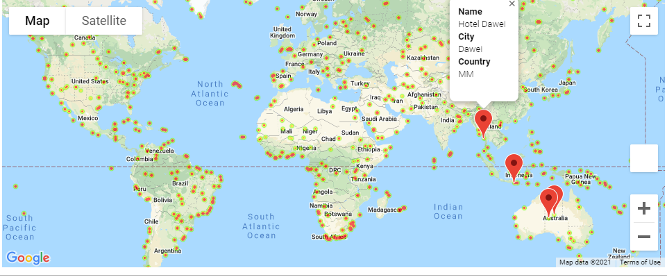

# Python API 

## Part II - VacationPy

Now let's use your skills in working with weather data to plan future vacations. Use jupyter-gmaps and the Google Places API for this part of the assignment.

* Heat map that displays the humidity for every city from Part I.

  

* Map with hotels found in cities with ideal weather condition.
  
  

