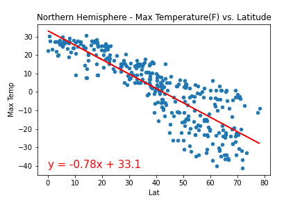
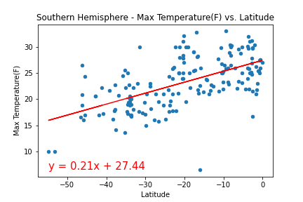

# Python API 

## Part I - Weather

Creating a Python script to visualize the weather of 500+ cities across the world of varying distance from the equator. To accomplish this, you'll be utilizing a simple Python library, the OpenWeatherMap API, and a little common sense to create a representative model of weather across world cities.

*Three observable trends based on the data

** In the grap, while the latitude is greater the max temp decrease.

  

** Cities that belong to the Northern Hemisphere tend to have a linear equation with a negative trend when the correlation between latitude and humidity is analyzed
  
  

** Cities that belong to the Southern Hemisphere tend to have a linear equation with a positive trend when the correlation between latitude and humidity is analyzed
  
  
  
  In conclusion, when the latitude gets closer to the equator the temperatures (when it gets closer to 0) of the cities tend to rise.
  

